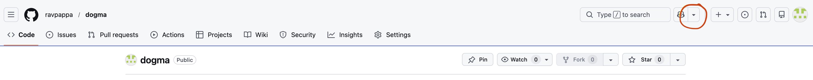

<h1> Welcome to the README file! </h1>

<h2> Using Git </h2>

Start a new repository: <ol>
    <li> Create a remote repository and copy its SSH URL: </li>
    <li> Provide the path to the remote repository: git remote add origin git@github.com:ravpappa/dogma </li>
    <li> Go to the working folder : cd ~/htdocs/dogma </li>
    <li> Initialize repository: git init dogma  </li>
    <li> Create README.md file: touch README.md </li>
    <li> Stage: git add * </li>
    <li> Commit: git commit -m "Initial commit" </li>
    <li> Push: git push -u origin main </li>
</ol>